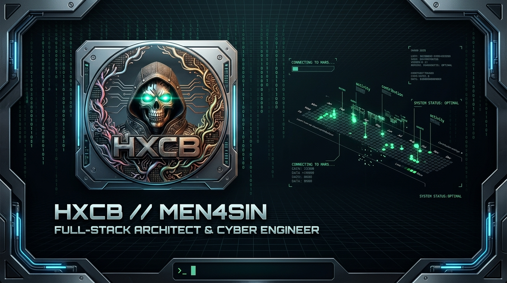

<div align="center">

  <!-- HXCB Cyberpunk Header Banner -->
  

  <br/><br/>

  <!-- Hacker Terminal Typing SVG -->
  <a href="https://git.io/typing-svg">
    
  </a>

</div>

<br/>

```terminal
┌──(operator㉿mars-station)-[~]
└─# cat << 'EOF' > system_status.json
{
  "operator": "MEN4SIN",
  "faction": "HXCBFX",
  "status": "System Status: OPTIMAL",
  "coordinates": "Pinging from Mars 🛰️",
  "specialization": [
    "High-Performance Architecture",
    "Offensive & Defensive Cyber",
    "Distributed Systems & Cloud",
    "DevSecOps & Zero Trust"
  ]
}
EOF
```

---

### 🛡️ Cyber Arsenal & Tech Stack

<div align="center">

#### Core & Systems


<br/>

#### Architecture, Cloud & Infrastructure


<br/>

#### Web & Application Ecosystem


</div>

<br/>

---

### 📡 Telemetry & Analytics

<div align="center">
  
  
</div>

<br/>

<div align="center">
  
</div>

<br/>

---

### 🔗 Establish Uplink

<div align="center">

  <a href="https://instagram.com/men4sin" target="_blank">
    
  </a>
  &nbsp;
  <a href="https://youtube.com/@Men4sin" target="_blank">
    
  </a>

</div>

<br/>

<div align="center">
  <code>HXCB // SECURING THE GRID • PINGING FROM MARS</code>
</div>
