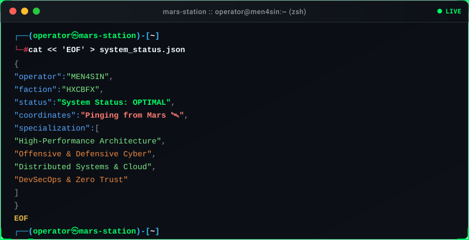

  <!-- Hacker Terminal Typing SVG -->
  

    

  <!-- High-Visual Vector Terminal HUD -->
  

 

### 📡 Telemetry & Analytics

  
  

 

  

 

  <code>HXCB // SECURING THE GRID • PINGING FROM MARS</code>

