  <!-- Header: Cyber Matrix Digital Rain & Neural Typing Animation -->
  

   

  <!-- Center: High-Visual Vector Terminal HUD -->
  

  <!-- Automated Streak Telemetry (Total, Current, Longest) -->
  

    

  <!-- Footer Links: Blurry Glassmorphic Uplink Buttons -->
  
  &nbsp;
  
  &nbsp;
  

    

  <code>HXCB // SECURING THE GRID • PINGING FROM MARS</code>

